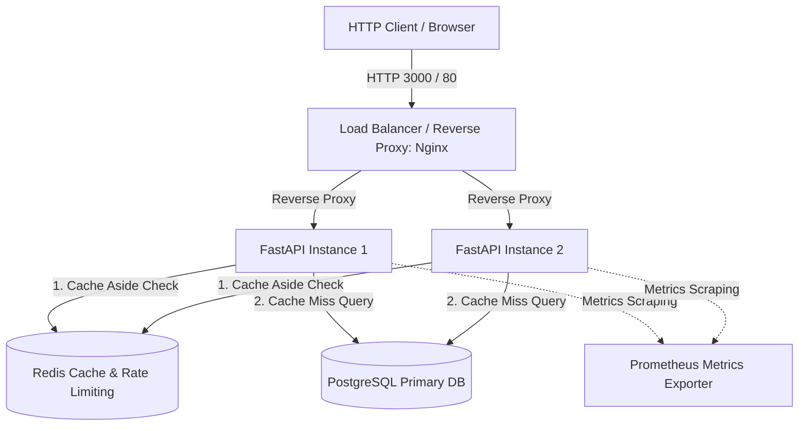
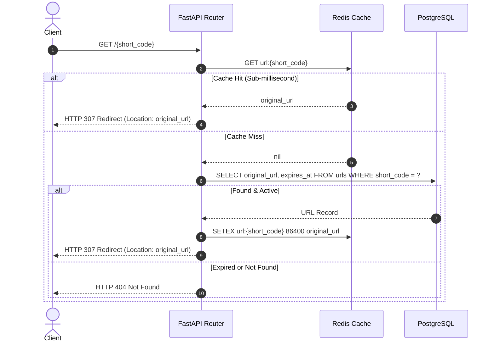
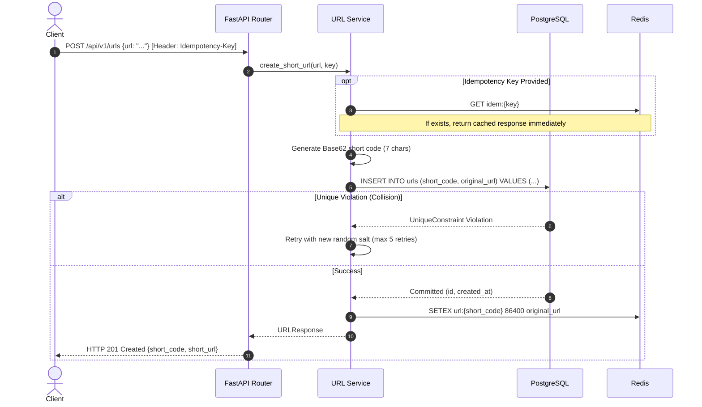

# URLForge - System Architecture & Design Document

URLForge is a production-style, high-concurrency URL shortener designed to demonstrate core computer science, backend engineering, and distributed system principles.

---

## 1. Requirements

### Functional Requirements
1. **Shorten URL:** Accept a long URL (HTTP/HTTPS) and generate a unique, short, URL-safe alias (e.g. `http://domain.com/aB91xK`).
2. **Redirect:** When a client accesses the short code, redirect immediately with HTTP 307 (Temporary Redirect) or 301/302 to the target URL.
3. **URL Metadata & Management:** Query metadata (creation date, expiration, click counts) and delete existing shortened links.
4. **Analytics:** Track click counts, access timestamps, user-agent details, and referrers with privacy-preserving anonymization.
5. **Health Probes:** Provide `GET /health` with operational readiness signals for load balancers.
6. **Idempotency:** Prevent duplicate creation when clients retry failed requests using an `Idempotency-Key` header.

### Non-Functional Requirements
1. **High Read Throughput:** The system is heavily read-dominant (~100:1 read-to-write ratio). Redirection must complete in under 5 milliseconds at P99.
2. **High Availability (HA):** Redirects must succeed even if secondary services (like analytics pipelines) experience lag.
3. **Graceful Degradation:** If Redis becomes unavailable, redirect lookups must fall back to PostgreSQL rather than returning HTTP 500 errors.
4. **Data Integrity:** Zero collision tolerance. Database unique constraints prevent race conditions.
5. **Horizontal Scalability:** Stateless API instances scale independently behind a round-robin load balancer.

---

## 2. High-Level Architecture Diagram

---

## 3. Read Path vs. Write Path Flows

### Redirection Flow (Read Path - Cache-Aside)

### URL Creation Flow (Write Path with Idempotency)

---

## 4. Database Schema Design

### `urls` Table
| Column | Type | Constraints | Description |
|---|---|---|---|
| `id` | BIGSERIAL / UUID | PRIMARY KEY | Internal surrogate identifier |
| `short_code` | VARCHAR(16) | UNIQUE, NOT NULL, INDEX (B-Tree) | 7-character Base62 token |
| `original_url` | TEXT | NOT NULL | Target destination URL |
| `created_at` | TIMESTAMPTZ | NOT NULL, DEFAULT NOW() | Record creation timestamp (UTC) |
| `expires_at` | TIMESTAMPTZ | NULLABLE, INDEX | Link expiration timestamp |
| `click_count` | BIGINT | NOT NULL, DEFAULT 0 | Cumulative access counter |
| `last_accessed_at` | TIMESTAMPTZ | NULLABLE | Most recent redirect timestamp |

### `click_events` Table (Analytics)
| Column | Type | Constraints | Description |
|---|---|---|---|
| `id` | BIGSERIAL | PRIMARY KEY | Event ID |
| `url_id` | BIGINT | FOREIGN KEY (`urls.id`) ON DELETE CASCADE | Target link reference |
| `clicked_at` | TIMESTAMPTZ | NOT NULL, DEFAULT NOW() | Timestamp of click |
| `referrer` | VARCHAR(512) | NULLABLE | HTTP Referer header |
| `user_agent_family` | VARCHAR(128) | NULLABLE | Parsed browser/device family |
| `ip_hash` | VARCHAR(64) | NULLABLE | Salted SHA-256 hash of client IP (privacy-compliant) |

---

## 5. Capacity & Resource Estimations

### Baseline Assumptions
* **Monthly New URLs:** 100 Million URLs/month
* **Read-to-Write Ratio:** 50:1 (5 Billion redirects/month)
* **Average URL Length:** 500 bytes

### Calculations
1. **Write Throughput (QPS):**
   $$\text{Writes/sec} = \frac{100,000,000}{30 \times 86400} \approx 38.6\text{ writes/sec (avg)}$$
   Peak factor $3\times \approx 120\text{ writes/sec}$.
2. **Read Throughput (QPS):**
   $$\text{Reads/sec} = 38.6 \times 50 \approx 1,930\text{ reads/sec (avg)}$$
   Peak factor $3\times \approx 5,800\text{ reads/sec}$.
3. **Storage Requirements:**
   * 1 URL record $\approx$ 1 KB (including indexes and metadata).
   * Per month: $100\text{M} \times 1\text{ KB} = 100\text{ GB/month}$.
   * 5 years storage: $100\text{ GB} \times 60 \approx 6\text{ TB}$.
4. **Cache Sizing (80/20 Rule):**
   * 20% of the URLs generate 80% of read traffic.
   * Daily active URLs $\approx 100\text{M} / 30 \times 20\% = 667,000\text{ hot URLs/day}$.
   * Cache RAM: $667,000 \times 500\text{ bytes} \approx 333\text{ MB}$.
   * Even a small 2 GB Redis instance comfortably caches all active hot links.

---

## 6. Resilience & Graceful Degradation
* **Redis Outage:** If Redis connectivity drops, the cache service catches `RedisError`, logs a warning metric, and queries PostgreSQL directly. The service remains 100% operational (albeit at slightly elevated database latency).
* **PostgreSQL Transient Latency:** Connection pooling with timeouts prevents thread starvation.
* **Database Collision Retry:** Exponential backoff retry loop catches database unique integrity errors and generates a fresh token.
